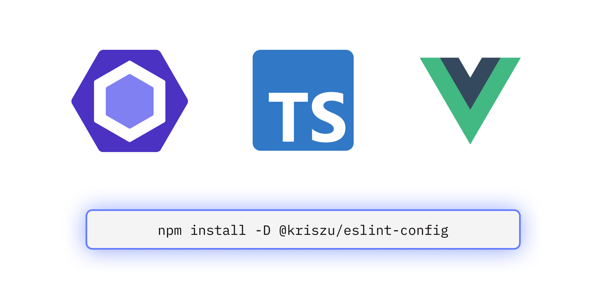

<picture>

</picture>

<div align="center">

[![npm version][npm-version-src]][npm-version-href]
[![npm downloads][npm-downloads-src]][npm-downloads-href]
[![License][license-src]][license-href]
[![code style][antfu-src]][antfu-href]
[![code quality][code-quality-src]][code-quality-href]

My ESlint configuration, based on `@antfu/eslint-config` with personal customizations. Flat ESLint config for JavaScript, TypeScript, Vue 2, Vue 3.

---

</div>

## Features

This is my personal ESlint configuration, based on the excellent [`@antfu/eslint-config`](https://github.com/antfu/eslint-config).

- Auto fix for formatting (aimed to be used standalone **without** Prettier)
- Reasonable defaults, best practices, only one line of config
- Designed to work with TypeScript, JSX, Vue, JSON, YAML, Toml, Markdown, etc. Out-of-box.
- [ESLint Flat config](https://eslint.org/docs/latest/use/configure/configuration-files-new), compose easily!
- Optional React, UnoCSS support
- Optional formatters support for formatting CSS, HTML, XML, etc.
- **Style principle**: Minimal for reading, stable for diff, consistent
  - Sorted imports, dangling commas
  - Single quotes
  - Using [ESLint Stylistic](https://github.com/eslint-stylistic/eslint-stylistic)
- Respects `.gitignore` by default
- Supports ESLint v9 or v8.50.0+

## Install

```bash
pnpm i -D eslint @kriszu/eslint-config
```

And create `eslint.config.mjs` in your project root:

```js
// eslint.config.mjs
import defineEslintConfig from '@kriszu/eslint-config'

export default defineEslintConfig()
```

> Note that `.eslintignore` no longer works in Flat config, see [customization](#customization) for more details.

### Add script for package.json

```json
{
  "scripts": {
    "lint": "eslint .",
    "lint:fix": "eslint . --fix"
  }
}
```

### Migration

We provided an experimental CLI tool to help you migrate from the legacy config to the new flat config.

```bash
npx @kriszu/eslint-config@latest
```

Before running the migration, make sure to commit your unsaved changes first.

## VS Code support (auto fix)

Install [VS Code ESLint extension](https://marketplace.visualstudio.com/items?itemName=dbaeumer.vscode-eslint)

Add the following settings to your `.vscode/settings.json`:

```jsonc
{
  // Enable the ESlint flat config support
  // (remove this if your ESLint extension above v3.0.5)
  "eslint.experimental.useFlatConfig": true,

  // Disable the default formatter, use eslint instead
  "prettier.enable": false,
  "editor.formatOnSave": false,

  // Auto fix
  "editor.codeActionsOnSave": {
    "source.fixAll.eslint": "explicit",
    "source.organizeImports": "never"
  },

  // Silent the stylistic rules in you IDE, but still auto fix them
  "eslint.rules.customizations": [
    { "rule": "style/*", "severity": "off", "fixable": true },
    { "rule": "format/*", "severity": "off", "fixable": true },
    { "rule": "*-indent", "severity": "off", "fixable": true },
    { "rule": "*-spacing", "severity": "off", "fixable": true },
    { "rule": "*-spaces", "severity": "off", "fixable": true },
    { "rule": "*-order", "severity": "off", "fixable": true },
    { "rule": "*-dangle", "severity": "off", "fixable": true },
    { "rule": "*-newline", "severity": "off", "fixable": true },
    { "rule": "*quotes", "severity": "off", "fixable": true },
    { "rule": "*semi", "severity": "off", "fixable": true }
  ],

  // Enable eslint for all supported languages
  "eslint.validate": [
    "javascript",
    "javascriptreact",
    "typescript",
    "typescriptreact",
    "vue",
    "html",
    "markdown",
    "json",
    "jsonc",
    "yaml",
    "xml",
    "gql",
    "graphql"
  ]
}
```

## Customization

```js
// eslint.config.js
import defineEslintConfig from '@kriszu/eslint-config'

export default defineEslintConfig()
```

And that's it! Or you can configure each integration individually, for example:

```js
// eslint.config.js
import defineEslintConfig from '@kriszu/eslint-config'

export default defineEslintConfig({
  // Enable stylistic formatting rules
  // stylistic: true,

  // `.eslintignore` is no longer supported in Flat config, use `ignores` instead
  ignores: [
    '**/fixtures',
    // ...globs
  ],

  // Disable jsonc support
  jsonc: false,
  // Or customize the stylistic rules
  stylistic: {
    indent: 2, // 4, or 'tab'
    quotes: 'single', // or 'double'
  },

  // TypeScript and Vue are auto-detected, you can also explicitly enable them:
  typescript: true,
  vue: true,
  // Disable yaml support
  yaml: false
})
```

Check out the [configs](https://github.com/wangsizhu0504/eslint-config/blob/main/packages/eslint-config/src/configs) and [factory](https://github.com/wangsizhu0504/eslint-config/blob/main/packages/eslint-config/src/factory.ts) for more details.

### Plugins Renaming

| New Prefix | Original Prefix        | Source Plugin                                                                              |
| ---------- | ---------------------- | ------------------------------------------------------------------------------------------ |
| `import/*` | `i/*`                  | [eslint-plugin-i](https://github.com/un-es/eslint-plugin-i)                                |
| `node/*`   | `n/*`                  | [eslint-plugin-n](https://github.com/eslint-community/eslint-plugin-n)                     |
| `ts/*`     | `@typescript-eslint/*` | [@typescript-eslint/eslint-plugin](https://github.com/typescript-eslint/typescript-eslint) |
| `style/*`  | `@stylistic/*`         | [@stylistic/eslint-plugin](https://github.com/eslint-stylistic/eslint-stylistic)           |
| `test/*`   | `vitest/*`             | [@vitest/eslint-plugin](https://github.com/vitest-dev/eslint-plugin-vitest)                |
| `test/*`   | `no-only-tests/*`      | [eslint-plugin-no-only-tests](https://github.com/levibuzolic/eslint-plugin-no-only-tests)  |

When you want to override rules, or disable them inline, you need to update to the new prefix:

```diff
-// eslint-disable-next-line @typescript-eslint/consistent-type-definitions
+// eslint-disable-next-line ts/consistent-type-definitions
type foo = { bar: 2 }
```

Running `npx eslint` should prompt you to install the required dependencies, otherwise, you can install them manually:

```bash
npm i -D eslint-plugin-format
```

#### React

To enable React support, you need to explicitly turn it on:

```js
// eslint.config.js
import defineEslintConfig from '@kriszu/eslint-config'

export default defineEslintConfig({
  react: true,
})
```

Running `npx eslint` should prompt you to install the required dependencies, otherwise, you can install them manually:

```bash
npm i -D @eslint-react/eslint-plugin eslint-plugin-react-hooks eslint-plugin-react-refresh
```

#### UnoCSS

To enable UnoCSS support, you need to explicitly turn it on:

```js
// eslint.config.js
import defineEslintConfig from '@kriszu/eslint-config'

export default defineEslintConfig({
  unocss: true,
})
```

Running `npx eslint` should prompt you to install the required dependencies, otherwise, you can install them manually:

```bash
npm i -D @unocss/eslint-plugin
```

### Lint Staged

If you want to apply lint and auto-fix before every commit, you can add the following to your `package.json`:

```json
{
  "simple-git-hooks": {
    "pre-commit": "pnpm lint-staged"
  },
  "lint-staged": {
    "*": "eslint --fix"
  }
}
```

## License

[MIT](./LICENSE) License © 2022-PRESENT [Kriszu](https://github.com/wangsizhu0504)

<!-- Badges -->

[npm-version-src]: https://img.shields.io/npm/v/@kriszu/eslint-config/latest.svg?style=flat&colorA=18181B&colorB=28CF8D
[npm-version-href]: https://npmjs.com/package/@kriszu/eslint-config
[npm-downloads-src]: https://img.shields.io/npm/dm/@kriszu/eslint-config.svg?style=flat&colorA=18181B&colorB=28CF8D
[npm-downloads-href]: https://npmjs.com/package/@kriszu/eslint-config
[code-quality-src]: https://img.shields.io/codacy/grade/2089b728f6904916aff7a595c4197b09.svg?style=flat&colorA=18181B&colorB=28CF8D
[code-quality-href]: https://app.codacy.com/gh/kriszu/eslint-config
[license-src]: https://img.shields.io/npm/l/@kriszu/eslint-config.svg?style=flat&colorA=18181B&colorB=28CF8D
[license-href]: https://npmjs.com/package/@kriszu/eslint-config
[antfu-src]: https://antfu.me/badge-code-style.svg
[antfu-href]: https://github.com/antfu/eslint-config
